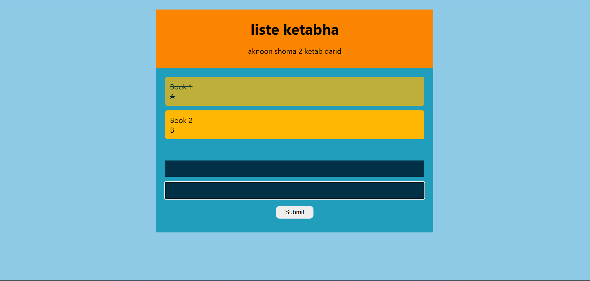

#  Library Project

A React-based library management application.

## Features

- Add new books
- Edit books
- Delete books
- Search books
- Filter by category
- Sort books
- Display creation date
- LocalStorage data persistence
- Context API & useReducer state management

##  Technologies

- React JS
- JavaScript
- Context API
- useReducer
- CSS
- LocalStorage

## 📸 Screenshot




##  Installation

Clone the project:

```bash
git clone https://github.com/norouzirezagon-dev/Library-Project.git